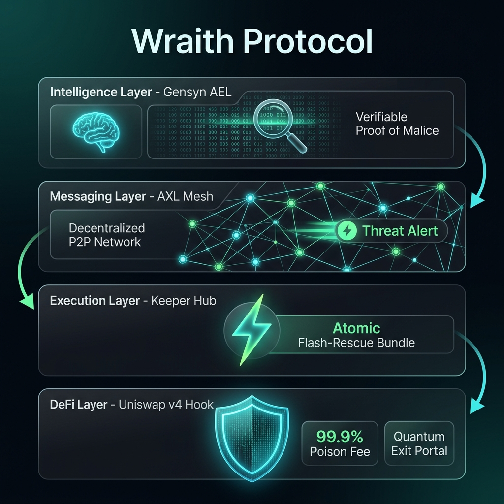
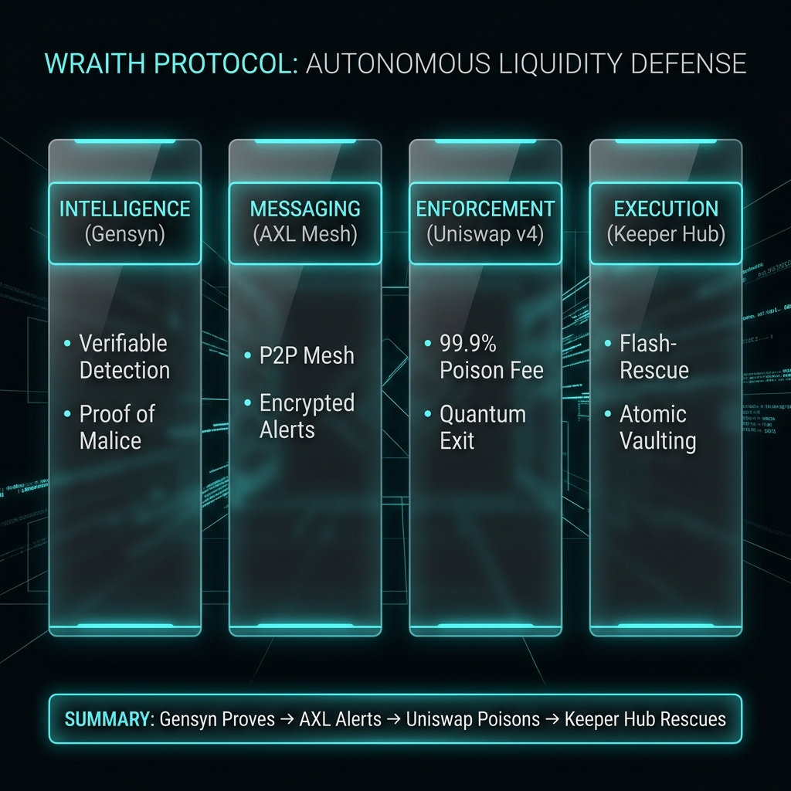

# 🛡️ Wraith Protocol — Autonomous Liquidity Defense

**Wraith Protocol** is a decentralized "Agent Guard" architecture designed to protect Liquidity Providers (LPs) . It leverages **Gensyn's Verifiable Compute (AEL)** and **AXL Mesh Networking** to detect malicious patterns in real-time and trigger atomic **KeeperHub Flash-Rescues** before rug-pulls are finalized.



---

## 🏛️ System Architecture

The Wraith system is a decentralized "Agent Guard" architecture composed of four primary layers:

1.  **DeFi Integration Layer (Uniswap v4 Hooks)**:
    -   **`WraithHook.sol`**: A custom Uniswap v4 hook that intercepts pool actions.
    -   **Poison Fee (`beforeSwap`)**: Dynamically overrides pool fees to **99.9%** for flagged malicious actors, effectively "poisoning" attacker capital.
    -   **Quantum Exit**: A permissioned function that allows authorized Keepers to atomically remove an LP's liquidity and move it to a safe vault during an attack.
    -   **EIP-1153 Transient Storage**: Manages per-block toxicity states and guard status efficiently, reducing gas costs.

2.  **Intelligence Layer (Gensyn Sentinel)**:
    -   **Autonomous Monitoring**: Monitors the Unichain mempool for rug-pull patterns and analyzes contract bytecode for malicious opcodes (`SELFDESTRUCT`).
    -   **Verifiable Inference (AEL)**: Runs toxicity models in Gensyn's **Bitwise Reproducible Execution Environment (REE)** to produce a **Verifiable Proof of Malice** (`proof_hash`).

3.  **Messaging Layer (AXL P2P Mesh)**:
    -   **Agent-to-Agent Messaging**: Broadcasts encrypted threat alerts across a decentralized mesh network, avoiding centralized relayers.
    -   **Cross-Language Support**: Facilitates seamless communication between the Python Sentinel and Node.js Keeper Relay via the AXL proxy.

4.  **Execution Layer (KeeperHub)**:
    -   **Flash-Rescue Bundles**: Executes atomic operations (Remove Liquidity -> Swap -> Vault Deposit) in a single block.
    -   **MEV Protection**: Submits bundles with high priority to ensure they execute before the attacker's transaction.
---

## ⛓️ Deployed Contracts (Unichain Sepolia)

The protocol is live and verified on the Unichain Sepolia testnet:

- **WraithHook**: [`0xD56388a4ce5Cd9E236201AD3DF27Edfbb28E0280`](https://unichain-sepolia.blockscout.com/address/0xD56388a4ce5Cd9E236201AD3DF27Edfbb28E0280)
- **PoolManager**: `0x00B036B58a818B1BC34d502D3fE730Db729e62AC` (Uniswap v4 Singleton)
- **WraithToken (WRAITH)**: [`0x9dA26648257a17bEB42d9464663b7b9Ce1c4f174`](https://unichain-sepolia.blockscout.com/address/0x9dA26648257a17bEB42d9464663b7b9Ce1c4f174)
- **QuantumPhantom (QPHAN)**: [`0x9d803A3066C858d714C4F5eE286eaa6249d451aB`](https://unichain-sepolia.blockscout.com/address/0x9d803A3066C858d714C4F5eE286eaa6249d451aB)
- **EternalEcho (ECHO)**: [`0x6586035D5e39e30bf37445451b43EEaEeAa1405a`](https://unichain-sepolia.blockscout.com/address/0x6586035D5e39e30bf37445451b43EEaEeAa1405a)
- **Mock USDC**: [`0x31d0220469e10c4E71834a79b1f276d740d3768F`](https://unichain-sepolia.blockscout.com/address/0x31d0220469e10c4E71834a79b1f276d740d3768F)

---

## 📂 Project Structure

```text
.
├── agents/                   # Gensyn Sentinel Agents (Python)
├── contracts/                # Uniswap v4 WraithHook (Solidity)
├── node/                     # Production Node Identity & Keys
├── scripts/                  # Keeper Relay & Deployment Scripts
├── frontend/                 # Next.js 14 Dashboard for LP management
└── test/                     # Advanced Foundry test suite
```

---

## 🛠️ Technical Stack

-   **Blockchain**: Unichain Sepolia (Optimism Stack)
-   **DEX**: Uniswap v4 (Hooks & Singleton)
-   **AI Infrastructure**: Gensyn (AEL, REE & AXL)
-   **Automation**: KeeperHub
-   **Storage**: EIP-1153 (Transient Storage)
-   **Languages**: Solidity, Python (3.13), TypeScript, Node.js

---

## 🚀 Production Deployment

Wraith Protocol is production-ready with a hybrid hosting model. For detailed instructions, see the **[Full Deployment Guide](DEPLOYMENT_GUIDE.md)**.

### Using Docker (Recommended)
```bash
cp .env.example .env
# Fill in your keys in .env
docker-compose up -d --build
```

### Agent Components
- **[Gensyn Sentinel Agent](agents/sentinel.py)**: Real-time on-chain toxicity monitor.
- **[Keeper Relay Agent](scripts/keeper_relay.js)**: Atomic Flash-Rescue execution engine.
- **[Frontend Dashboard](frontend/)**: Next.js interface for user management (Deploy via Vercel).

### ⚖️ Judging & Simulation Guide

To evaluate the **Wraith Protocol** active defense mechanisms, judges can follow these steps to simulate a "Toxicity Event" and observe the autonomous response.

#### 1. Setup Environment
Ensure your `.env` has the following variables:
```bash
UNICHAIN_RPC_URL=https://sepolia.unichain.org
WRAITH_HOOK_ADDRESS=0xD56388a4ce5Cd9E236201AD3DF27Edfbb28E0280
PRIVATE_KEY=<YOUR_PRIVATE_KEY>
```

#### 2. Simulate High Toxicity (The Trigger)
Judges can manually flag a pool as "Toxic" to trigger the protocol's defense state. Use the `manual_toxicity.js` script to set a score above the threshold (8500).

*Example: Flag the WRAITH/USDC pool as critical (95.00%):*
```bash
# Usage: node scripts/manual_toxicity.cjs <POOL_ID> <SCORE>
node scripts/manual_toxicity.cjs 0xbf4bf38f15e9235195e7fe78f4f789a6f5cbd1625fc7e47d5485bfd0f44aeee2 9500
```

#### 3. Clear/Reset Toxicity
To return a pool to a "Safe" state, use the `clear` command:
```bash
node scripts/manual_toxicity.cjs 0xbf4bf38f15e9235195e7fe78f4f789a6f5cbd1625fc7e47d5485bfd0f44aeee2 clear
```

#### 4. Observe the "Poison Fee"
1. Open the **Wraith Dashboard** at `http://localhost:3000`.
2. Input the Pool ID: `0xbf4bf38f15e9235195e7fe78f4f789a6f5cbd1625fc7e47d5485bfd0f44aeee2`.
3. You will see the **Toxicity Meter** spike to 95% and the **DEFENSE ARMED** status turn green.
4. Any swap attempt from a non-registered address will now be subject to the **99.9% Poison Fee** override.

#### 4. Trigger the "Quantum Exit" (The Rescue)
Once toxicity is high, the "Quantum Exit" becomes available for registered LPs.
1. In the Dashboard, go to the **Wraith Guard** section.
2. Click **"TRIGGER QUANTUM EXIT"**.
3. Observe as the protocol atomically removes your liquidity and transfers it to your secure vault *before* the pool can be drained.

---

### 🛡️ Core Reliability Stack
- **Gensyn AEL**: Verifiable toxicity scoring using bitwise-reproducible REE.
- **AXL Agent Mesh**: Encrypted P2P (Agent-to-Agent) communication layer.
- **KeeperHub**: Decentralized reliability layer for atomic flash-rescue bundles.


---

### 📊 Summary & Presentation
Below is a high-level technical memo summarizing the core defense pipeline of the Wraith Protocol.



*Protecting the future of DeFi with Verifiable AI. Built for the Gensyn & KeeperHub Hackathon 2026.*
